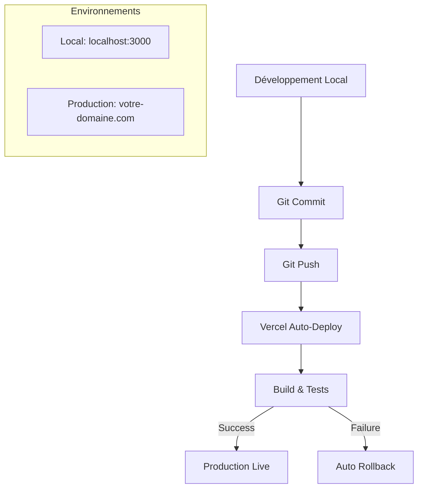
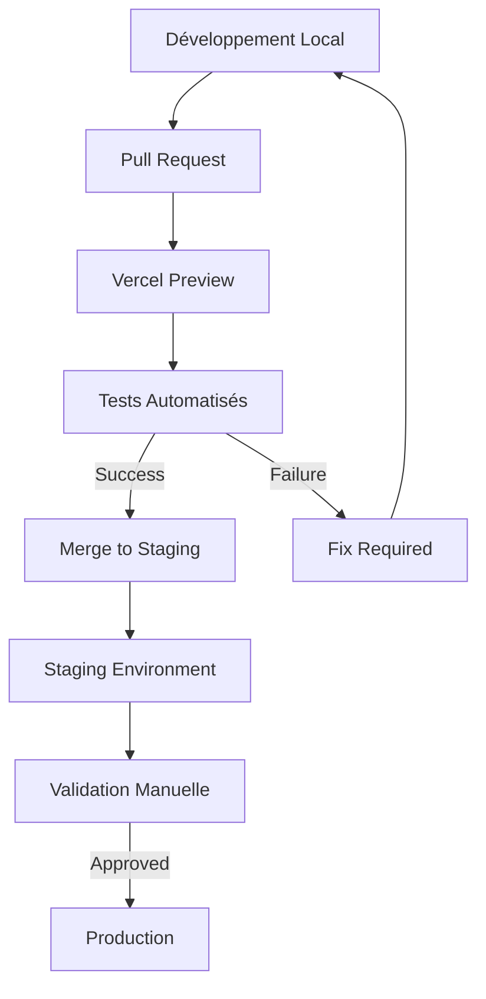

# 🚀 Procédures de Déploiement et CI/CD
## Tidimondo - Guide Complet de Déploiement

---

## 📋 Vue d'Ensemble du Pipeline

### Workflow de Déploiement Actuel (Phase 1)


### Workflow Futur avec Staging (Phase 2)


---

## 🔧 Configuration Vercel

### Structure du Projet Vercel
```json
{
  "version": 2,
  "name": "tidimondo",
  "builds": [
    {
      "src": "package.json",
      "use": "@vercel/next"
    }
  ],
  "routes": [
    {
      "src": "/api/(.*)",
      "dest": "/api/$1"
    }
  ],
  "functions": {
    "app/api/**/*.ts": {
      "maxDuration": 30
    }
  },
  "env": {
    "NODE_ENV": "production"
  }
}
```

### Configuration des Environnements Vercel

#### Production
```bash
# Vercel Dashboard > Settings > Environment Variables
# Environment: Production

# Application
NODE_ENV=production
NEXT_PUBLIC_APP_ENV=production
NEXT_PUBLIC_APP_URL=https://votre-domaine.com

# Clerk (Production Instance)
NEXT_PUBLIC_CLERK_PUBLISHABLE_KEY=pk_live_xxx
CLERK_SECRET_KEY=sk_live_xxx
CLERK_WEBHOOK_SECRET=whsec_xxx

# Supabase (Production Project)
NEXT_PUBLIC_SUPABASE_URL=https://xxx.supabase.co
NEXT_PUBLIC_SUPABASE_ANON_KEY=eyJxxx
SUPABASE_SERVICE_ROLE_KEY=eyJxxx
SUPABASE_JWT_SECRET=xxx

# Stripe (Live Mode)
STRIPE_SECRET_KEY=sk_live_xxx
NEXT_PUBLIC_STRIPE_PUBLISHABLE_KEY=pk_live_xxx
STRIPE_WEBHOOK_SECRET=whsec_xxx
STRIPE_PRICE_ID_BASIC=price_xxx
STRIPE_PRICE_ID_PRO=price_xxx
STRIPE_PRICE_ID_ENTERPRISE=price_xxx
```

#### Preview/Staging (Futur)
```bash
# Vercel Dashboard > Settings > Environment Variables
# Environment: Preview

# Application
NODE_ENV=production
NEXT_PUBLIC_APP_ENV=staging
NEXT_PUBLIC_APP_URL=https://tidimondo-git-staging.vercel.app

# Clerk (Staging Instance)
NEXT_PUBLIC_CLERK_PUBLISHABLE_KEY=pk_test_xxx
CLERK_SECRET_KEY=sk_test_xxx
CLERK_WEBHOOK_SECRET=whsec_xxx

# Supabase (Staging Project)
NEXT_PUBLIC_SUPABASE_URL=https://xxx-staging.supabase.co
NEXT_PUBLIC_SUPABASE_ANON_KEY=eyJxxx
SUPABASE_SERVICE_ROLE_KEY=eyJxxx
SUPABASE_JWT_SECRET=xxx

# Stripe (Test Mode)
STRIPE_SECRET_KEY=sk_test_xxx
NEXT_PUBLIC_STRIPE_PUBLISHABLE_KEY=pk_test_xxx
STRIPE_WEBHOOK_SECRET=whsec_xxx
```

---

## 🗄️ Gestion des Migrations de Base de Données

### Workflow de Migrations Supabase

#### Développement Local vers Dev Project
```bash
# 1. Développer localement
supabase start
supabase db reset

# 2. Créer une migration
supabase db diff --file new_feature

# 3. Tester la migration localement
supabase db reset
supabase migration up

# 4. Pousser vers le projet de développement
supabase db push --project-ref <dev-project-ref>
```

#### Dev Project vers Production
```bash
# 1. Valider que toutes les migrations fonctionnent en dev
supabase db push --project-ref <dev-project-ref>

# 2. Créer un backup de production
# (Fait automatiquement par Supabase)

# 3. Appliquer en production
supabase db push --project-ref <prod-project-ref>

# 4. Vérifier l'état de la base
supabase db remote commit --project-ref <prod-project-ref>
```

### Script de Migration Automatisé
```bash
#!/bin/bash
# scripts/migrate.sh

set -e

ENVIRONMENT=${1:-dev}
PROJECT_REF=""

case $ENVIRONMENT in
  "dev")
    PROJECT_REF=$SUPABASE_DEV_PROJECT_REF
    ;;
  "staging")
    PROJECT_REF=$SUPABASE_STAGING_PROJECT_REF
    ;;
  "prod")
    PROJECT_REF=$SUPABASE_PROD_PROJECT_REF
    ;;
  *)
    echo "Usage: ./migrate.sh [dev|staging|prod]"
    exit 1
    ;;
esac

echo "🚀 Applying migrations to $ENVIRONMENT environment..."
echo "📊 Project ref: $PROJECT_REF"

# Backup (pour staging et prod)
if [ "$ENVIRONMENT" != "dev" ]; then
  echo "💾 Creating backup..."
  # Supabase fait des backups automatiques
fi

# Apply migrations
echo "📝 Applying migrations..."
supabase db push --project-ref $PROJECT_REF

echo "✅ Migrations applied successfully to $ENVIRONMENT!"
```

---

## 🧪 Tests et Validation

### Tests Automatisés par Environnement

#### Tests Locaux
```bash
# Package.json scripts
{
  "scripts": {
    "test": "jest",
    "test:watch": "jest --watch",
    "test:coverage": "jest --coverage",
    "test:e2e": "playwright test",
    "test:integration": "jest --testPathPattern=integration",
    "test:unit": "jest --testPathPattern=unit"
  }
}
```

#### Tests d'Intégration par Service
```bash
# Tests Clerk
npm run test:clerk

# Tests Supabase
npm run test:supabase

# Tests Stripe
npm run test:stripe

# Tests E2E complets
npm run test:e2e
```

### Configuration des Tests

#### Jest Configuration (`jest.config.js`)
```javascript
module.exports = {
  testEnvironment: 'node',
  setupFilesAfterEnv: ['<rootDir>/tests/setup.ts'],
  testMatch: [
    '<rootDir>/tests/**/*.test.ts',
    '<rootDir>/src/**/*.test.ts'
  ],
  collectCoverageFrom: [
    'src/**/*.{ts,tsx}',
    '!src/**/*.d.ts',
    '!src/**/*.stories.tsx'
  ],
  coverageThreshold: {
    global: {
      branches: 70,
      functions: 70,
      lines: 70,
      statements: 70
    }
  }
}
```

#### Playwright Configuration (`playwright.config.ts`)
```typescript
import { defineConfig } from '@playwright/test'

export default defineConfig({
  testDir: './tests/e2e',
  fullyParallel: true,
  forbidOnly: !!process.env.CI,
  retries: process.env.CI ? 2 : 0,
  workers: process.env.CI ? 1 : undefined,
  reporter: 'html',
  use: {
    baseURL: process.env.NEXT_PUBLIC_APP_URL || 'http://localhost:3000',
    trace: 'on-first-retry',
  },
  projects: [
    {
      name: 'chromium',
      use: { ...devices['Desktop Chrome'] },
    },
    {
      name: 'firefox',
      use: { ...devices['Desktop Firefox'] },
    },
  ],
  webServer: {
    command: 'npm run dev',
    url: 'http://localhost:3000',
    reuseExistingServer: !process.env.CI,
  },
})
```

---

## 🔄 Procédures de Déploiement

### Déploiement en Production (Phase 1)

#### Checklist Pré-Déploiement
- [ ] Tests locaux passent (`npm run test`)
- [ ] Tests E2E passent (`npm run test:e2e`)
- [ ] Build local réussit (`npm run build`)
- [ ] Variables d'environnement configurées dans Vercel
- [ ] Migrations de base de données appliquées
- [ ] Webhooks configurés (Clerk, Stripe)

#### Procédure de Déploiement
```bash
# 1. Vérifications locales
npm run test
npm run build
npm run test:e2e

# 2. Commit et push
git add .
git commit -m "feat: nouvelle fonctionnalité"
git push origin main

# 3. Vercel déploie automatiquement
# 4. Vérifier le déploiement sur https://vercel.com/dashboard
# 5. Tester en production
```

### Déploiement avec Staging (Phase 2 - Futur)

#### Workflow avec Pull Request
```bash
# 1. Créer une branche feature
git checkout -b feature/nouvelle-fonctionnalite

# 2. Développer et tester localement
npm run dev
npm run test

# 3. Créer une Pull Request
git push origin feature/nouvelle-fonctionnalite
# Créer PR sur GitHub

# 4. Vercel crée automatiquement un preview
# 5. Tests automatisés sur le preview
# 6. Review et merge vers staging
# 7. Tests sur staging
# 8. Merge vers main (production)
```

---

## 🚨 Gestion des Incidents et Rollback

### Procédure de Rollback Rapide

#### Rollback Vercel (Immédiat)
```bash
# Via Dashboard Vercel
1. Aller sur vercel.com/dashboard
2. Sélectionner le projet
3. Onglet "Deployments"
4. Cliquer sur "Promote to Production" sur un déploiement précédent

# Via CLI Vercel
vercel --prod --force
```

#### Rollback Base de Données
```bash
# Supabase ne permet pas de rollback automatique
# Procédure manuelle :

# 1. Identifier la migration problématique
supabase migration list --project-ref <project-ref>

# 2. Créer une migration de correction
supabase db diff --file fix_rollback

# 3. Appliquer la correction
supabase db push --project-ref <project-ref>
```

### Monitoring et Alertes

#### Métriques à Surveiller
- **Vercel** : Temps de build, erreurs de déploiement
- **Supabase** : Connexions DB, temps de réponse
- **Clerk** : Taux d'authentification, erreurs
- **Stripe** : Taux de succès des paiements

#### Configuration des Alertes
```javascript
// Exemple avec Sentry
import * as Sentry from '@sentry/nextjs'

Sentry.init({
  dsn: process.env.SENTRY_DSN,
  environment: process.env.NEXT_PUBLIC_APP_ENV,
  tracesSampleRate: 1.0,
})
```

---

## 📊 Scripts de Déploiement

### Package.json Scripts
```json
{
  "scripts": {
    "dev": "next dev --turbopack",
    "build": "next build",
    "start": "next start",
    "lint": "next lint",
    "test": "jest",
    "test:watch": "jest --watch",
    "test:e2e": "playwright test",
    "test:coverage": "jest --coverage",
    "deploy:staging": "./scripts/deploy-staging.sh",
    "deploy:prod": "./scripts/deploy-prod.sh",
    "migrate:dev": "./scripts/migrate.sh dev",
    "migrate:staging": "./scripts/migrate.sh staging",
    "migrate:prod": "./scripts/migrate.sh prod",
    "backup:prod": "./scripts/backup.sh prod",
    "health-check": "./scripts/health-check.sh"
  }
}
```

### Script de Health Check
```bash
#!/bin/bash
# scripts/health-check.sh

set -e

ENVIRONMENT=${1:-production}
BASE_URL=""

case $ENVIRONMENT in
  "local")
    BASE_URL="http://localhost:3000"
    ;;
  "staging")
    BASE_URL="https://tidimondo-git-staging.vercel.app"
    ;;
  "production")
    BASE_URL="https://votre-domaine.com"
    ;;
esac

echo "🏥 Health check for $ENVIRONMENT environment..."
echo "🌐 URL: $BASE_URL"

# Check main page
echo "📄 Checking main page..."
curl -f "$BASE_URL" > /dev/null

# Check API health
echo "🔌 Checking API health..."
curl -f "$BASE_URL/api/health" > /dev/null

# Check database connection
echo "🗄️ Checking database..."
curl -f "$BASE_URL/api/health/db" > /dev/null

# Check authentication
echo "🔐 Checking authentication..."
curl -f "$BASE_URL/api/health/auth" > /dev/null

echo "✅ All health checks passed for $ENVIRONMENT!"
```

---

## 🔐 Sécurité du Déploiement

### Variables Sensibles
- ✅ Toutes les clés de production dans Vercel Environment Variables
- ✅ Rotation des clés API tous les 6 mois
- ✅ Webhooks avec secrets validés
- ✅ HTTPS forcé en production

### Audit et Logs
```bash
# Logs Vercel
vercel logs --follow

# Logs Supabase
# Via Dashboard Supabase > Logs

# Logs Clerk
# Via Dashboard Clerk > Logs

# Logs Stripe
# Via Dashboard Stripe > Logs
```

---

## 📅 Planning de Maintenance

### Maintenance Régulière
- **Hebdomadaire** : Review des logs et métriques
- **Mensuelle** : Tests de rollback et backup
- **Trimestrielle** : Audit de sécurité
- **Semestrielle** : Rotation des clés API

### Fenêtres de Maintenance
- **Préférée** : Dimanche 2h-4h (UTC+1)
- **Alternative** : Mercredi 1h-3h (UTC+1)
- **Urgence** : Immédiate avec notification

---

*Document créé le : 2025-01-28*  
*Version : 1.0*  
*Lié à : ARCHITECTURE_STRATEGY.md, ENVIRONMENT_TEMPLATES.md*