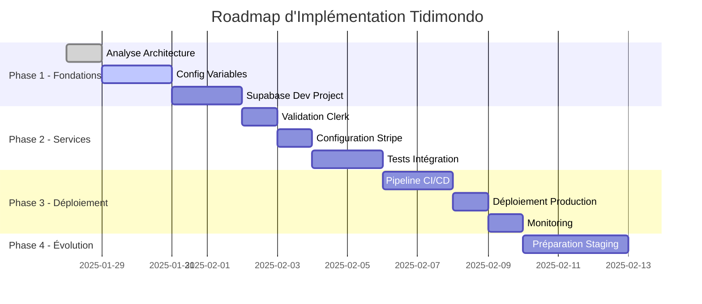

# 🗺️ Roadmap d'Implémentation
## Tidimondo - Plan d'Action Détaillé

---

## 📊 Vue d'Ensemble du Plan

### Phases d'Implémentation


---

## 🎯 Phase 1 : Fondations (Semaine 1)

### ✅ Jour 1 : Analyse et Planification
- [x] Analyse de l'architecture actuelle
- [x] Identification des points d'amélioration
- [x] Conception de la stratégie d'environnements
- [x] Création de la documentation stratégique

### 📋 Jour 2-3 : Configuration des Variables d'Environnement

#### Actions Immédiates
```bash
# 1. Sauvegarder la configuration actuelle
cp .env.local .env.local.backup

# 2. Créer la structure des environnements
mkdir -p environments
mkdir -p scripts

# 3. Créer les templates
touch .env.example
touch environments/development.env.example
touch environments/production.env.example
```

#### Restructuration des Variables
1. **Analyser le `.env.local` actuel**
   - Identifier les variables de développement vs production
   - Séparer les clés Clerk dev/prod
   - Vérifier les clés Stripe test/live

2. **Créer les nouveaux fichiers**
   - `.env.example` (template public)
   - `.env.local` (développement restructuré)
   - Templates pour production/staging

3. **Valider la configuration**
   ```bash
   npm run dev
   # Vérifier que l'application fonctionne
   ```

### 🗄️ Jour 4-5 : Projet Supabase de Développement

#### Création du Projet Dev
1. **Aller sur supabase.com/dashboard**
2. **Créer un nouveau projet**
   - Nom : `tidimondo-development`
   - Région : Europe (West)
   - Plan : Free (pour commencer)

3. **Configurer le projet**
   ```bash
   # Récupérer les nouvelles clés
   SUPABASE_DEV_URL=https://xxx.supabase.co
   SUPABASE_DEV_ANON_KEY=eyJxxx
   SUPABASE_DEV_SERVICE_KEY=eyJxxx
   ```

#### Migration du Schéma
```bash
# 1. Configurer Supabase CLI pour le nouveau projet
supabase link --project-ref <nouveau-project-ref>

# 2. Appliquer les migrations existantes
supabase db push

# 3. Vérifier le schéma
supabase db diff
```

#### Tests de Connexion
```bash
# Créer un script de test
node -e "
const { createClient } = require('@supabase/supabase-js');
const client = createClient(process.env.NEXT_PUBLIC_SUPABASE_URL, process.env.NEXT_PUBLIC_SUPABASE_ANON_KEY);
client.from('profiles').select('*').limit(1).then(console.log);
"
```

---

## 🔧 Phase 2 : Configuration des Services (Semaine 2)

### 🔐 Jour 6 : Validation Clerk

#### Vérification des Instances
1. **Aller sur dashboard.clerk.com**
2. **Vérifier les instances existantes**
   - Instance de développement
   - Instance de production
   - Domaines configurés

3. **Configurer les domaines**
   ```
   Développement:
   - http://localhost:3000
   - http://127.0.0.1:3000
   
   Production:
   - https://votre-domaine.com
   ```

#### Configuration des Webhooks
```bash
# Endpoints à configurer
Development: http://localhost:3000/api/webhooks/clerk
Production: https://votre-domaine.com/api/webhooks/clerk

# Events à écouter:
- user.created
- user.updated
- user.deleted
- session.created
```

### 💳 Jour 7 : Configuration Stripe

#### Vérification des Clés
1. **Aller sur dashboard.stripe.com**
2. **Vérifier la séparation test/live**
   ```bash
   # Test Keys (développement)
   STRIPE_SECRET_KEY=sk_test_xxx
   STRIPE_PUBLISHABLE_KEY=pk_test_xxx
   
   # Live Keys (production)
   STRIPE_SECRET_KEY=sk_live_xxx
   STRIPE_PUBLISHABLE_KEY=pk_live_xxx
   ```

#### Configuration des Webhooks
```bash
# Endpoints Stripe
Development: http://localhost:3000/api/webhooks/stripe
Production: https://votre-domaine.com/api/webhooks/stripe

# Events à écouter:
- checkout.session.completed
- customer.subscription.created
- customer.subscription.updated
- customer.subscription.deleted
- invoice.payment_succeeded
- invoice.payment_failed
```

#### Test des Paiements
```bash
# Utiliser les cartes de test Stripe
4242424242424242 # Visa success
4000000000000002 # Card declined
4000000000009995 # Insufficient funds
```

### 🧪 Jour 8-9 : Tests d'Intégration

#### Configuration Jest
```bash
npm install --save-dev jest @types/jest ts-jest
npx ts-jest config:init
```

#### Tests par Service
```typescript
// tests/integration/clerk.test.ts
describe('Clerk Integration', () => {
  test('should authenticate user', async () => {
    // Test d'authentification
  })
})

// tests/integration/supabase.test.ts
describe('Supabase Integration', () => {
  test('should connect to database', async () => {
    // Test de connexion DB
  })
})

// tests/integration/stripe.test.ts
describe('Stripe Integration', () => {
  test('should create checkout session', async () => {
    // Test de création de session
  })
})
```

#### Tests E2E avec Playwright
```bash
npm install --save-dev @playwright/test
npx playwright install
```

```typescript
// tests/e2e/auth-flow.spec.ts
test('complete authentication flow', async ({ page }) => {
  await page.goto('/')
  await page.click('[data-testid="sign-in"]')
  // Test du flow complet
})
```

---

## 🚀 Phase 3 : Déploiement (Semaine 3)

### 🔄 Jour 10-11 : Pipeline CI/CD

#### Configuration Vercel
1. **Connecter le repository GitHub**
2. **Configurer les variables d'environnement**
   ```bash
   # Production Environment Variables
   NODE_ENV=production
   NEXT_PUBLIC_APP_ENV=production
   # ... toutes les variables de production
   ```

3. **Configurer les domaines**
   - Domaine principal
   - Redirections www
   - Certificats SSL

#### Scripts de Déploiement
```bash
# scripts/deploy-prod.sh
#!/bin/bash
set -e

echo "🚀 Deploying to production..."

# Pre-deployment checks
npm run test
npm run build
npm run test:e2e

# Deploy
git push origin main

echo "✅ Deployment initiated!"
```

#### GitHub Actions (Optionnel)
```yaml
# .github/workflows/deploy.yml
name: Deploy to Production
on:
  push:
    branches: [main]
jobs:
  deploy:
    runs-on: ubuntu-latest
    steps:
      - uses: actions/checkout@v2
      - uses: actions/setup-node@v2
      - run: npm ci
      - run: npm run test
      - run: npm run build
```

### 🌐 Jour 12 : Déploiement Production

#### Checklist Pré-Déploiement
- [ ] Variables d'environnement configurées dans Vercel
- [ ] Domaine configuré et SSL activé
- [ ] Base de données de production migrée
- [ ] Webhooks Clerk configurés
- [ ] Webhooks Stripe configurés
- [ ] Tests passent en local

#### Procédure de Déploiement
```bash
# 1. Derniers tests
npm run test
npm run build
npm run test:e2e

# 2. Migration de la base de données
npm run migrate:prod

# 3. Déploiement
git add .
git commit -m "feat: production ready"
git push origin main

# 4. Vérification post-déploiement
npm run health-check production
```

### 📊 Jour 13 : Monitoring et Validation

#### Configuration du Monitoring
1. **Vercel Analytics**
   - Activer dans le dashboard Vercel
   - Configurer les alertes

2. **Supabase Monitoring**
   - Dashboard > Logs
   - Configurer les alertes de performance

3. **Stripe Monitoring**
   - Dashboard > Logs
   - Configurer les alertes de paiement

#### Tests de Production
```bash
# Health checks
curl https://votre-domaine.com/api/health
curl https://votre-domaine.com/api/health/db
curl https://votre-domaine.com/api/health/auth

# Tests fonctionnels
# - Inscription d'un utilisateur
# - Connexion
# - Création d'un abonnement
# - Webhook de paiement
```

---

## 🔮 Phase 4 : Évolution Future (Semaine 4)

### 🧪 Jour 14-16 : Préparation Staging

#### Planification de l'Environnement Staging
1. **Nouvelles instances à créer**
   - Clerk Staging Instance
   - Supabase Staging Project
   - Stripe Test Environment dédié

2. **Configuration Vercel Preview**
   ```bash
   # Variables pour Preview Environment
   NODE_ENV=production
   NEXT_PUBLIC_APP_ENV=staging
   # ... variables de staging
   ```

3. **Workflow avec Branches**
   ```bash
   # Nouvelle structure Git
   main (production)
   ├── staging (environnement de staging)
   └── develop (développement)
   ```

#### Documentation de l'Évolution
- Mise à jour des procédures
- Formation de l'équipe
- Tests du nouveau workflow

---

## 📋 Checklist d'Implémentation

### Phase 1 - Fondations
- [ ] Analyse architecture terminée
- [ ] Variables d'environnement restructurées
- [ ] Projet Supabase dev créé et configuré
- [ ] Tests de connexion validés

### Phase 2 - Services
- [ ] Instances Clerk validées
- [ ] Configuration Stripe vérifiée
- [ ] Webhooks configurés et testés
- [ ] Tests d'intégration en place

### Phase 3 - Déploiement
- [ ] Pipeline CI/CD configuré
- [ ] Variables Vercel configurées
- [ ] Déploiement production réussi
- [ ] Monitoring en place

### Phase 4 - Évolution
- [ ] Plan staging documenté
- [ ] Workflow Git défini
- [ ] Équipe formée

---

## 🚨 Points d'Attention et Risques

### Risques Identifiés
1. **Migration de données**
   - Backup avant migration
   - Tests sur données de dev

2. **Interruption de service**
   - Déploiement en heures creuses
   - Plan de rollback prêt

3. **Configuration des webhooks**
   - Tester en développement d'abord
   - Valider les signatures

### Mesures de Mitigation
- Tests complets avant chaque étape
- Backups automatiques
- Monitoring en temps réel
- Procédures de rollback documentées

---

## 📞 Support et Ressources

### Contacts Techniques
- **Supabase** : Support via dashboard
- **Clerk** : Support via dashboard
- **Stripe** : Documentation + support
- **Vercel** : Documentation + communauté

### Documentation de Référence
- [Supabase CLI](https://supabase.com/docs/reference/cli)
- [Clerk Next.js](https://clerk.com/docs/nextjs)
- [Stripe Node.js](https://stripe.com/docs/api/node)
- [Vercel Deployment](https://vercel.com/docs/deployments)

---

## 📅 Timeline Recommandée

### Implémentation Rapide (1 semaine)
- Jour 1-2 : Variables + Supabase dev
- Jour 3-4 : Validation services
- Jour 5-7 : Déploiement production

### Implémentation Complète (3 semaines)
- Semaine 1 : Fondations
- Semaine 2 : Services et tests
- Semaine 3 : Déploiement et monitoring

### Évolution Staging (+ 1 semaine)
- Semaine 4 : Préparation environnement staging

---

*Document créé le : 2025-01-28*  
*Version : 1.0*  
*Prochaine révision : Après Phase 1*