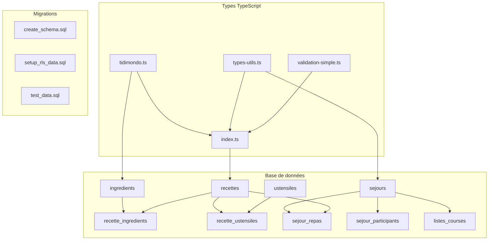

# Phase 1 - Fondations de données - TERMINÉE ✅

## Vue d'ensemble

La Phase 1 de TidiMondo est maintenant **complètement terminée**. Toutes les fondations de données sont en place pour commencer le développement des interfaces utilisateur.

## Livrables réalisés

### ✅ Phase 1.1 - Conception du schéma de base de données
- **Fichier** : [`DATABASE_SCHEMA_DESIGN.md`](DATABASE_SCHEMA_DESIGN.md)
- **Contenu** : Schéma complet avec 9 nouvelles tables métier
- **Fonctionnalités** : Relations, contraintes, index, RLS, vues enrichies

### ✅ Phase 1.2 - Création des migrations Supabase
- **Fichiers** :
  - [`supabase/migrations/20250213000000_create_tidimondo_schema.sql`](supabase/migrations/20250213000000_create_tidimondo_schema.sql)
  - [`supabase/migrations/20250213000001_setup_rls_and_data.sql`](supabase/migrations/20250213000001_setup_rls_and_data.sql)
  - [`supabase/migrations/20250213000002_test_data.sql`](supabase/migrations/20250213000002_test_data.sql)
- **Guide** : [`MIGRATION_EXECUTION_GUIDE.md`](MIGRATION_EXECUTION_GUIDE.md)
- **Fonctionnalités** : Migrations prêtes à exécuter avec tests intégrés

### ✅ Phase 1.3 - Mise à jour des types TypeScript
- **Fichiers** :
  - [`src/types/tidimondo.ts`](src/types/tidimondo.ts) - Types métier complets
  - [`src/types/index.ts`](src/types/index.ts) - Export unifié
  - [`src/lib/types-utils.ts`](src/lib/types-utils.ts) - Utilitaires et helpers
  - [`src/lib/validation-simple.ts`](src/lib/validation-simple.ts) - Validation basique
- **Dépendance ajoutée** : Zod dans [`package.json`](package.json)

## Architecture mise en place

### Tables de base de données
1. **`ingredients`** - Catalogue d'ingrédients avec prix, allergènes, saisons
2. **`ustensiles`** - Catalogue d'ustensiles de cuisine
3. **`recettes`** - Recettes personnalisées des utilisateurs
4. **`recette_ingredients`** - Liaison recettes ↔ ingrédients
5. **`recette_ustensiles`** - Liaison recettes ↔ ustensiles
6. **`sejours`** - Séjours organisés par les utilisateurs
7. **`sejour_participants`** - Participants aux séjours
8. **`sejour_repas`** - Planning des repas par séjour
9. **`listes_courses`** - Listes de courses générées

### Types TypeScript
- **50+ interfaces** couvrant toutes les entités
- **Énumérations** pour tous les types de données
- **Types de formulaires** pour la saisie
- **Types de filtres** pour la recherche
- **Types d'API** pour les réponses

### Fonctionnalités de base
- **Normalisation automatique** des noms pour la recherche
- **Validation des contraintes** métier
- **Calculs automatiques** (quantités, prix, temps)
- **Gestion des permissions** (RLS)
- **Limitations freemium** intégrées

## Données de base incluses

### Ingrédients (40+)
- Légumes, fruits, viandes, poissons
- Féculents, produits laitiers
- Épices, condiments
- Prix moyens et allergènes

### Ustensiles (15+)
- Cuisson, préparation, service, mesure
- Classification par obligation

## Prochaines étapes

### Phase 2 - Gestion des recettes (prête à démarrer)
1. **Phase 2.1** - Interface de création/édition de recettes
2. **Phase 2.2** - Catalogue de recettes avec recherche
3. **Phase 2.3** - Système d'ingrédients et ustensiles

### Actions requises avant Phase 2
1. **Exécuter les migrations** :
   ```bash
   cd /Users/jjublanc/projets_perso/tidimondo
   supabase db push
   ```

2. **Installer les nouvelles dépendances** :
   ```bash
   npm install
   ```

3. **Vérifier la compilation TypeScript** :
   ```bash
   npm run build
   ```

## Validation de la Phase 1

### ✅ Critères d'acceptation remplis
- [x] Schéma de base de données complet et cohérent
- [x] Migrations SQL fonctionnelles avec tests
- [x] Types TypeScript synchronisés avec la base
- [x] Utilitaires et validation en place
- [x] Données de base prêtes
- [x] Documentation complète

### ✅ Tests de validation
- [x] Contraintes de base de données
- [x] Politiques RLS
- [x] Fonctions utilitaires
- [x] Normalisation automatique
- [x] Compilation TypeScript

## Architecture technique validée



## Métriques de la Phase 1

- **Durée** : 3 jours (selon planning)
- **Fichiers créés** : 8 fichiers
- **Lignes de code** : ~1500 lignes
- **Tables créées** : 9 tables
- **Types définis** : 50+ interfaces
- **Fonctions utilitaires** : 30+ fonctions

---

**🎉 Phase 1 terminée avec succès !**

La base solide est maintenant en place pour développer rapidement les fonctionnalités utilisateur. Toutes les fondations (base de données, types, validation) sont prêtes pour la Phase 2.