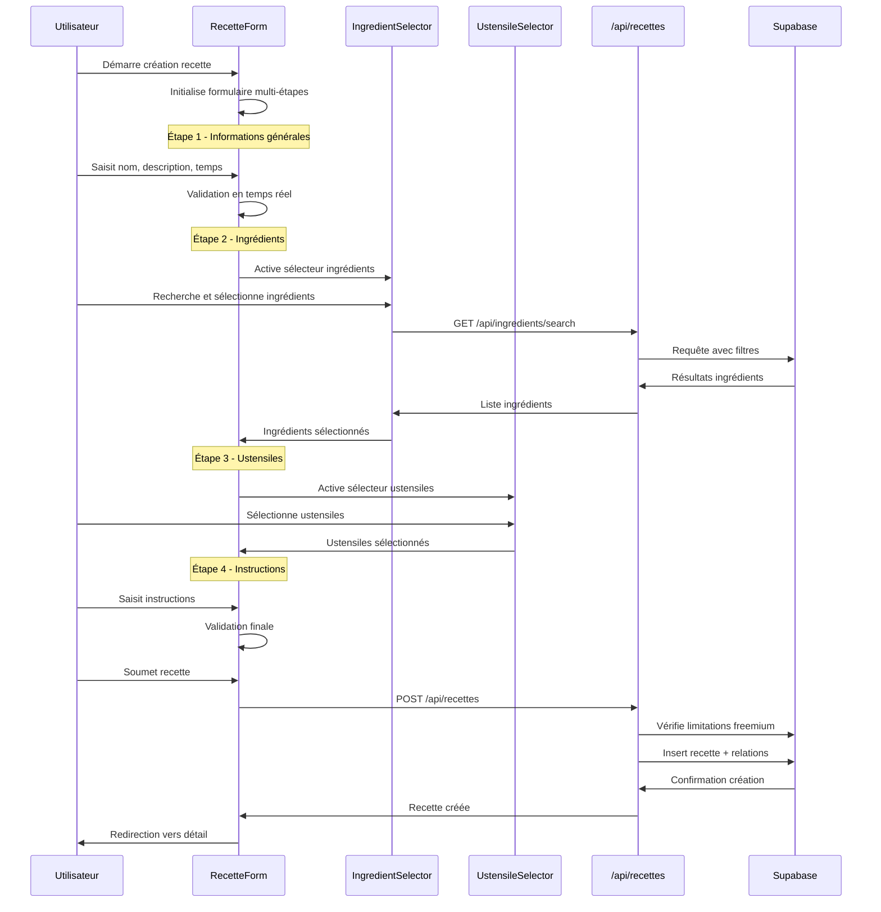
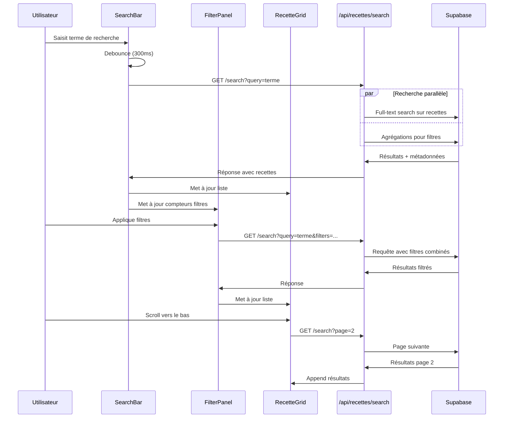
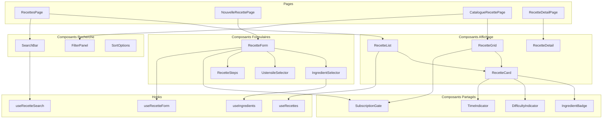
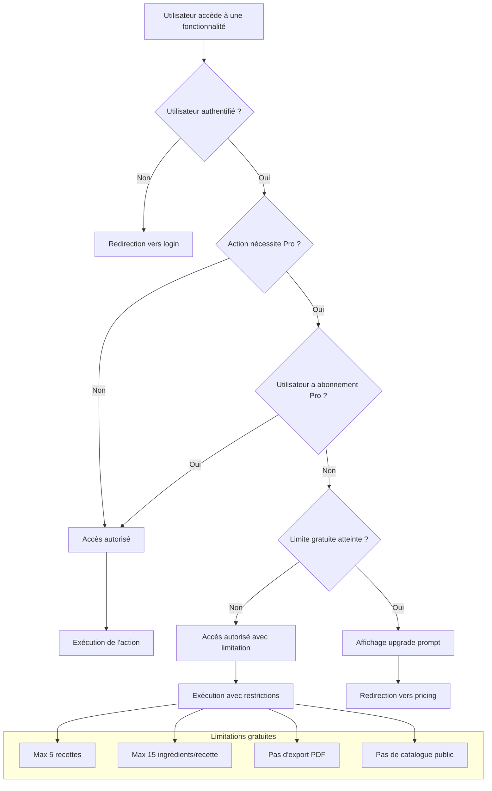
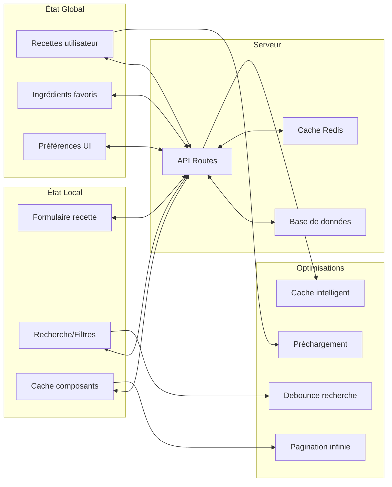
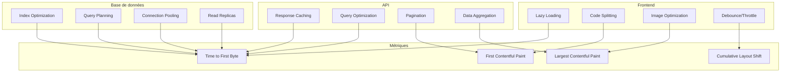
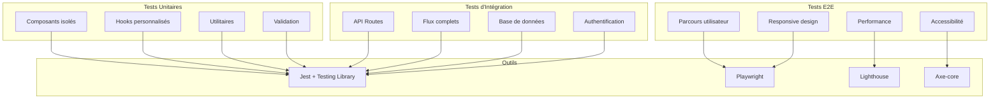
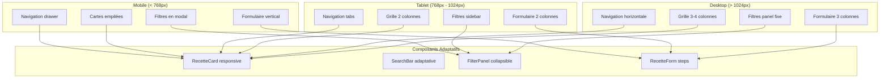

# Phase 2 - Diagrammes d'architecture

## 🏗️ Vue d'ensemble du système

```mermaid
graph TB
    subgraph "Frontend - Pages"
        A[Dashboard] --> B[/recettes]
        B --> C[/recettes/nouvelle]
        B --> D[/recettes/catalogue]
        B --> E[/recettes/[id]]
        E --> F[/recettes/[id]/modifier]
        B --> G[/ingredients]
    end
    
    subgraph "Frontend - Composants"
        H[RecetteForm]
        I[IngredientSelector]
        J[UstensileSelector]
        K[SearchBar]
        L[FilterPanel]
        M[RecetteGrid]
    end
    
    subgraph "API Routes"
        N[/api/recettes]
        O[/api/recettes/[id]]
        P[/api/recettes/search]
        Q[/api/ingredients]
        R[/api/ustensiles]
    end
    
    subgraph "Base de données"
        S[(recettes)]
        T[(recette_ingredients)]
        U[(recette_ustensiles)]
        V[(ingredients)]
        W[(ustensiles)]
    end
    
    C --> H
    H --> I
    H --> J
    D --> K
    D --> L
    D --> M
    
    H --> N
    I --> Q
    J --> R
    K --> P
    M --> O
    
    N --> S
    N --> T
    N --> U
    Q --> V
    R --> W
    P --> S
```

## 🔄 Flux de création de recette



## 🔍 Flux de recherche et filtrage



## 🧩 Architecture des composants



## 🔒 Gestion des permissions



## 📊 Flux de données



## 🚀 Stratégie de performance



## 🧪 Stratégie de tests



## 📱 Responsive Design



---

Ces diagrammes fournissent une vision claire de l'architecture de la Phase 2, facilitant la compréhension des interactions entre composants et la planification de l'implémentation.