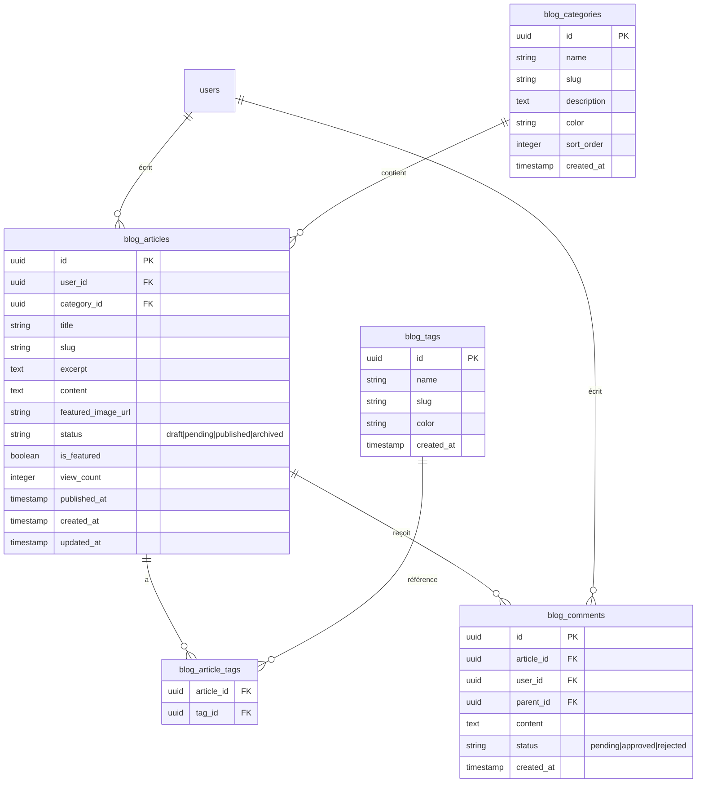

# 📋 Plan détaillé pour l'ajout du blog TidiMondo

## 🏗️ Architecture existante analysée

**Stack technique :**
- **Frontend :** Next.js 14 avec App Router, TypeScript, Tailwind CSS
- **Backend :** API Routes Next.js + Supabase PostgreSQL
- **Authentification :** Clerk avec intégration Supabase
- **Paiements :** Stripe avec système freemium
- **UI :** Composants custom + Lucide React pour les icônes

**Patterns identifiés :**
- Structure modulaire avec types TypeScript centralisés dans [`src/types/tidimondo.ts`](src/types/tidimondo.ts)
- API Routes RESTful dans [`src/app/api/`](src/app/api/)
- Système de permissions freemium via [`src/lib/freemium-utils.ts`](src/lib/freemium-utils.ts)
- Composants réutilisables dans [`src/components/`](src/components/)
- Pages protégées dans [`src/app/(protected)/`](src/app/(protected)/)

## 🎯 Modèle de données proposé



## 🔧 Fonctionnalités détaillées

### **1. Gestion des articles**
- **Administrateurs :** Création, modification, suppression, modération
- **Utilisateurs Premium :** Création d'articles (soumis à modération)
- **Utilisateurs Gratuits :** Lecture seule

### **2. Système de catégories**
- Catégories prédéfinies : "Conseils voyage", "Organisation séjours", "Astuces pratiques", "Destinations"
- Gestion administrative des catégories

### **3. Système de tags**
- Tags libres pour une meilleure organisation
- Auto-complétion lors de la saisie

### **4. Modération**
- Workflow : `draft` → `pending` → `published`
- Interface admin pour approuver/rejeter les articles utilisateurs

### **5. Restrictions freemium**
- **Gratuit :** Lecture seule
- **Premium :** 5 articles par mois maximum
- **Admin :** Illimité

## 📁 Structure des fichiers proposée

```
src/
├── types/
│   └── blog.ts                    # Types TypeScript pour le blog
├── app/
│   ├── (public)/
│   │   └── blog/
│   │       ├── page.tsx           # Liste des articles
│   │       ├── [slug]/
│   │       │   └── page.tsx       # Détail d'un article
│   │       └── categorie/
│   │           └── [slug]/
│   │               └── page.tsx   # Articles par catégorie
│   ├── (protected)/
│   │   └── blog/
│   │       ├── mes-articles/
│   │       │   └── page.tsx       # Articles de l'utilisateur
│   │       ├── nouveau/
│   │       │   └── page.tsx       # Créer un article
│   │       ├── [id]/
│   │       │   ├── page.tsx       # Voir article
│   │       │   └── modifier/
│   │       │       └── page.tsx   # Modifier article
│   │       └── admin/
│   │           ├── page.tsx       # Dashboard admin
│   │           ├── articles/
│   │           ├── categories/
│   │           └── moderation/
│   └── api/
│       └── blog/
│           ├── articles/
│           ├── categories/
│           ├── tags/
│           └── comments/
├── components/
│   └── blog/
│       ├── ArticleCard.tsx
│       ├── ArticleEditor.tsx
│       ├── CategoryFilter.tsx
│       ├── CommentSection.tsx
│       └── ModerationQueue.tsx
└── lib/
    └── blog-utils.ts              # Utilitaires blog + restrictions freemium
```

## 🎨 Interface utilisateur

### **Navigation principale**
- Ajout d'un lien "Blog" dans le header
- Section blog dans le dashboard avec statistiques

### **Pages publiques**
- **`/blog`** : Liste des articles avec filtres par catégorie/tag
- **`/blog/[slug]`** : Détail d'un article avec commentaires
- **`/blog/categorie/[slug]`** : Articles d'une catégorie

### **Pages utilisateur premium**
- **`/blog/mes-articles`** : Gestion des articles personnels
- **`/blog/nouveau`** : Éditeur d'article (Markdown + preview)

### **Interface admin**
- **`/blog/admin`** : Dashboard avec statistiques
- **`/blog/admin/moderation`** : Queue de modération
- **`/blog/admin/categories`** : Gestion des catégories

## 🔒 Sécurité et permissions

### **Middleware de protection**
- Vérification des rôles (admin/premium/gratuit)
- Limitation du nombre d'articles pour les utilisateurs premium

### **RLS (Row Level Security)**
- Articles : visibilité selon le statut et l'auteur
- Commentaires : modération automatique

## 📊 Intégration freemium

### **Limites proposées**
```typescript
export const BLOG_FREEMIUM_LIMITS = {
  articles_per_month: 5,        // Pour les utilisateurs premium
  comments_per_day: 10,         // Pour tous les utilisateurs
  max_article_length: 5000,     // Caractères pour premium
}
```

### **Fonctionnalités premium**
- Publication d'articles (avec modération)
- Commentaires illimités
- Analytics sur ses articles
- Export PDF des articles

## 🚀 Plan de déploiement

### **Phase 1 : Infrastructure**
1. Migrations de base de données
2. Types TypeScript
3. API routes de base

### **Phase 2 : Interface admin**
1. Dashboard administrateur
2. Gestion des catégories
3. Système de modération

### **Phase 3 : Interface utilisateur**
1. Pages publiques du blog
2. Interface de création pour premium
3. Système de commentaires

### **Phase 4 : Optimisations**
1. SEO et métadonnées
2. Recherche et filtres avancés
3. Analytics et statistiques

## 📝 Détails techniques

### **Base de données**
- Extension des tables existantes avec préfixe `blog_`
- Utilisation des UUID comme clés primaires (cohérent avec l'existant)
- RLS policies pour la sécurité

### **API Design**
- RESTful endpoints suivant les patterns existants
- Pagination pour les listes d'articles
- Filtres et recherche intégrés

### **Types TypeScript**
- Extension du fichier `tidimondo.ts` ou création d'un fichier `blog.ts` séparé
- Interfaces pour tous les modèles de données
- Types pour les formulaires et filtres

### **Composants UI**
- Réutilisation des composants existants (Button, Header, etc.)
- Nouveaux composants spécifiques au blog
- Design cohérent avec l'application existante

## 🎯 Objectifs du blog

### **Contenu ciblé**
- **Conseils d'organisation de séjours** : planification, budget, logistique
- **Guides de destinations** : recommandations, spécialités locales
- **Astuces pratiques** : préparation des bagages, gestion des groupes
- **Retours d'expérience** : témoignages d'utilisateurs

### **Valeur ajoutée**
- Positionnement expert sur l'organisation de séjours
- Communauté d'utilisateurs engagés
- Contenu premium pour fidéliser les abonnés
- SEO pour attirer de nouveaux utilisateurs

## ✅ Critères de succès

### **Métriques techniques**
- Temps de chargement < 2s pour les pages blog
- Interface responsive sur tous les appareils
- Intégration seamless avec l'application existante

### **Métriques business**
- Augmentation de l'engagement utilisateur
- Conversion freemium → premium via le blog
- Amélioration du SEO et du trafic organique

---

**Ce plan détaillé couvre tous les aspects de l'ajout du blog à TidiMondo, en respectant l'architecture existante et en intégrant parfaitement le système freemium.**