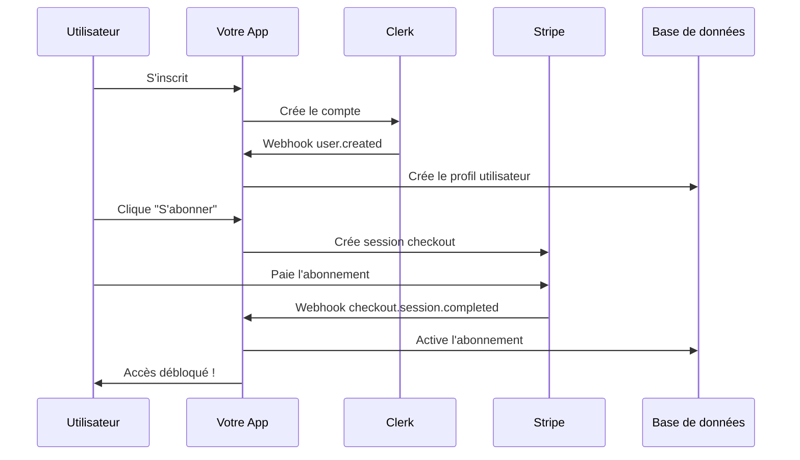

# 🔗 Webhooks : Pourquoi sont-ils essentiels pour votre SaaS ?

## 🤔 Qu'est-ce qu'un webhook ?

Un webhook est comme un **"rappel automatique"** que Stripe (ou Clerk) fait à votre application quand quelque chose d'important se passe.

### Analogie simple :
Imaginez que vous commandez une pizza :
- **Sans webhook** : Vous devez appeler toutes les 5 minutes pour demander "C'est prêt ?"
- **Avec webhook** : Le pizzaiolo vous appelle automatiquement quand c'est prêt

## 🎯 Pourquoi les webhooks sont CRITIQUES pour un SaaS ?

### 1. **Synchronisation en temps réel**
Sans webhooks, votre base de données peut être désynchronisée avec Stripe/Clerk.

**Exemple concret :**
```
❌ SANS WEBHOOK :
1. Client paie son abonnement sur Stripe ✅
2. Stripe encaisse le paiement ✅
3. Votre app ne le sait pas ❌
4. Client ne peut pas accéder au service ❌
5. Client mécontent appelle le support ❌

✅ AVEC WEBHOOK :
1. Client paie son abonnement sur Stripe ✅
2. Stripe encaisse le paiement ✅
3. Stripe notifie votre app via webhook ✅
4. Votre app active l'accès automatiquement ✅
5. Client content, accès immédiat ✅
```

### 2. **Gestion automatique des événements**

#### Webhooks Stripe essentiels :

**`checkout.session.completed`** 
- **Quand** : Un client termine son paiement
- **Action** : Activer l'abonnement dans votre base de données

**`customer.subscription.updated`**
- **Quand** : Un client change de plan (upgrade/downgrade)
- **Action** : Mettre à jour les permissions dans votre app

**`invoice.payment_failed`**
- **Quand** : Le paiement mensuel échoue (carte expirée, etc.)
- **Action** : Suspendre l'accès, envoyer un email de relance

**`customer.subscription.deleted`**
- **Quand** : Un client annule son abonnement
- **Action** : Désactiver l'accès, sauvegarder les données

#### Webhooks Clerk essentiels :

**`user.created`**
- **Quand** : Un utilisateur s'inscrit
- **Action** : Créer son profil dans votre base de données

**`user.updated`**
- **Quand** : Un utilisateur modifie ses infos
- **Action** : Synchroniser les changements

## 📊 Flux complet d'un SaaS avec webhooks



## 🚨 Que se passe-t-il SANS webhooks ?

### Problèmes courants :

1. **Désynchronisation** : Votre app ne sait pas qui a payé
2. **Accès manuel** : Vous devez activer chaque compte à la main
3. **Délais** : Les clients attendent des heures pour accéder au service
4. **Erreurs** : Risque d'oublier d'activer/désactiver des comptes
5. **Support surchargé** : Clients qui appellent car leur accès ne fonctionne pas

### Exemple catastrophe :
```
😱 SCÉNARIO CAUCHEMAR :
- 100 clients s'abonnent le même jour
- Aucun webhook configuré
- Vous devez manuellement :
  ✋ Vérifier chaque paiement dans Stripe
  ✋ Activer chaque compte dans votre app
  ✋ Envoyer un email de confirmation
  ✋ Gérer les réclamations des clients
  ✋ Travailler le weekend pour rattraper
```

## ✅ Avantages des webhooks

### 1. **Automatisation complète**
- Activation/désactivation automatique des comptes
- Gestion des échecs de paiement
- Mise à jour des plans en temps réel

### 2. **Expérience utilisateur parfaite**
- Accès immédiat après paiement
- Pas d'attente, pas de friction
- Clients satisfaits = moins de churn

### 3. **Fiabilité**
- Stripe/Clerk garantissent la livraison des webhooks
- Retry automatique en cas d'échec
- Historique complet des événements

### 4. **Scalabilité**
- Gère automatiquement 1 ou 10 000 clients
- Pas d'intervention manuelle
- Vous pouvez dormir tranquille 😴

## 🛠️ Implémentation dans votre SaaS

### Structure des webhooks dans votre app :

```
src/app/api/webhooks/
├── stripe/
│   └── route.ts          # Gère tous les événements Stripe
└── clerk/
    └── route.ts          # Gère tous les événements Clerk
```

### Exemple de logique webhook Stripe :

```typescript
// Pseudo-code simplifié
export async function POST(request: Request) {
  const event = await stripe.webhooks.constructEvent(...)
  
  switch (event.type) {
    case 'checkout.session.completed':
      // ✅ Activer l'abonnement
      await activateSubscription(event.data.object)
      break
      
    case 'invoice.payment_failed':
      // ⚠️ Suspendre l'accès
      await suspendAccess(event.data.object)
      break
      
    case 'customer.subscription.deleted':
      // ❌ Annuler l'abonnement
      await cancelSubscription(event.data.object)
      break
  }
}
```

## 🎯 Cas d'usage concrets pour TidiMondo

### Scénario 1 : Nouveau client
1. **Inscription** → Webhook Clerk → Création profil
2. **Paiement** → Webhook Stripe → Activation accès
3. **Accès immédiat** au dashboard

### Scénario 2 : Paiement échoué
1. **Échec paiement** → Webhook Stripe
2. **Suspension automatique** de l'accès
3. **Email de relance** automatique
4. **Réactivation** dès que le paiement passe

### Scénario 3 : Annulation
1. **Client annule** → Webhook Stripe
2. **Accès maintenu** jusqu'à la fin de période
3. **Désactivation automatique** à l'échéance
4. **Sauvegarde des données** avant suppression

## 🔒 Sécurité des webhooks

### Pourquoi le webhook secret ?
- **Vérification** que l'événement vient bien de Stripe/Clerk
- **Protection** contre les attaques malveillantes
- **Intégrité** des données garantie

### Sans le secret :
```
😈 ATTAQUE POSSIBLE :
1. Hacker découvre votre URL webhook
2. Envoie de faux événements "payment_succeeded"
3. Active des comptes gratuits
4. Vous perdez de l'argent
```

## 📈 Impact business

### Avec webhooks bien configurés :
- ✅ **Conversion** : Accès immédiat = moins d'abandon
- ✅ **Rétention** : Expérience fluide = clients satisfaits  
- ✅ **Automatisation** : Moins de support = plus de temps pour développer
- ✅ **Fiabilité** : Système robuste = réputation solide

### Sans webhooks :
- ❌ **Friction** : Délais d'activation = clients frustrés
- ❌ **Erreurs** : Gestion manuelle = risque d'oublis
- ❌ **Support** : Réclamations constantes = coûts élevés
- ❌ **Scalabilité** : Impossible de grandir sans automatisation

## 🎯 Conclusion

Les webhooks ne sont pas optionnels pour un SaaS, ils sont **ESSENTIELS** :

1. **Automatisation** de la gestion des abonnements
2. **Synchronisation** temps réel avec les services externes
3. **Expérience utilisateur** fluide et professionnelle
4. **Scalabilité** pour grandir sans limites

**Sans webhooks = SaaS amateur**  
**Avec webhooks = SaaS professionnel** 🚀

Voulez-vous que nous implémentions maintenant ces webhooks dans votre application ?