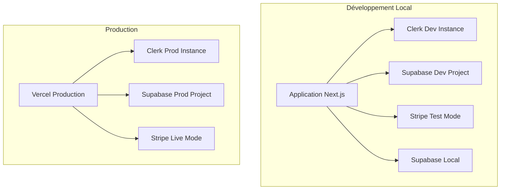
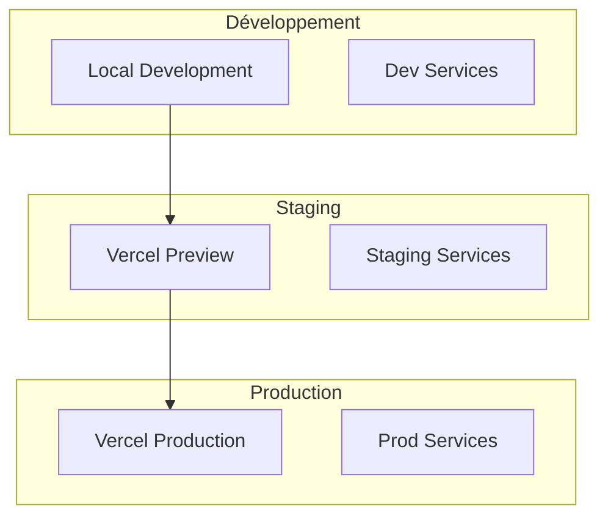
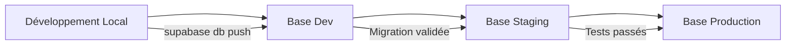
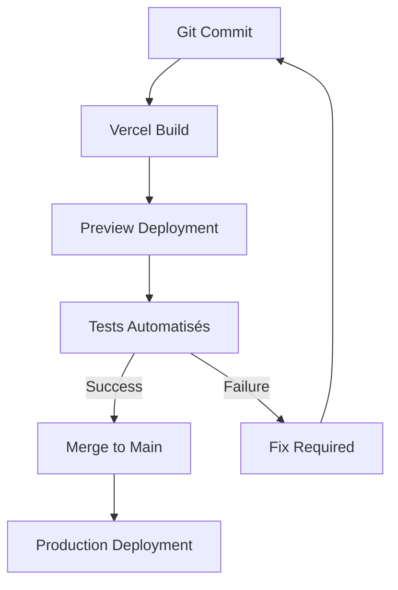

# 🏗️ Stratégie d'Architecture Multi-Environnements
## Tidimondo - Clerk + Supabase + Stripe

---

## 📊 Analyse de l'Architecture Actuelle

### État Actuel Identifié
- **Application** : Next.js 15 avec TypeScript
- **Authentification** : Clerk (instances dev + prod existantes)
- **Base de données** : Supabase (1 projet prod uniquement)
- **Paiements** : Stripe (clés test/live mélangées)
- **Variables d'environnement** : `.env.local` unique avec toutes les clés
- **Migrations** : Système Supabase en place avec 6 migrations
- **Déploiement** : Prévu sur Vercel

### Points d'Amélioration Identifiés
1. **Isolation des environnements** : Manque de séparation claire dev/prod
2. **Gestion des variables** : Configuration centralisée non optimale
3. **Base de données** : Pas d'environnement de développement dédié
4. **Sécurité** : Risque de mélange des clés de production
5. **CI/CD** : Pipeline à structurer

---

## 🎯 Stratégie d'Environnements Proposée

### Phase 1 : Dev/Prod (Immédiat)


### Phase 2 : Dev/Staging/Prod (Évolution Future)


---

## 🔧 Configuration des Services par Environnement

### Clerk
| Environnement | Instance | Configuration |
|---------------|----------|---------------|
| **Development** | Instance Dev existante | Domaines locaux autorisés |
| **Production** | Instance Prod existante | Domaine de production |
| **Staging** (futur) | Nouvelle instance | Domaines de preview Vercel |

### Supabase
| Environnement | Projet | Base de données |
|---------------|--------|-----------------|
| **Development** | **À créer** | Projet Supabase dédié dev |
| **Local** | Supabase CLI | Base locale (déjà configurée) |
| **Production** | Projet existant | Base de production actuelle |
| **Staging** (futur) | **À créer** | Projet Supabase dédié staging |

### Stripe
| Environnement | Mode | Clés |
|---------------|------|------|
| **Development** | Test | Clés de test dédiées |
| **Production** | Live | Clés de production |
| **Staging** (futur) | Test | Clés de test dédiées |

---

## 📁 Structure des Variables d'Environnement

### Fichiers de Configuration Proposés
```
├── .env.example                 # Template public
├── .env.local                   # Development (git-ignored)
├── .env.production             # Production (Vercel)
├── .env.staging                # Staging futur (Vercel)
└── environments/
    ├── development.env.example
    ├── production.env.example
    └── staging.env.example
```

### Template des Variables par Service

#### Clerk
```bash
# Clerk Configuration
NEXT_PUBLIC_CLERK_PUBLISHABLE_KEY=pk_test_xxx
CLERK_SECRET_KEY=sk_test_xxx
NEXT_PUBLIC_CLERK_SIGN_IN_URL=/sign-in
NEXT_PUBLIC_CLERK_SIGN_UP_URL=/sign-up
NEXT_PUBLIC_CLERK_AFTER_SIGN_IN_URL=/dashboard
NEXT_PUBLIC_CLERK_AFTER_SIGN_UP_URL=/dashboard
CLERK_WEBHOOK_SECRET=whsec_xxx
```

#### Supabase
```bash
# Supabase Configuration
NEXT_PUBLIC_SUPABASE_URL=https://xxx.supabase.co
NEXT_PUBLIC_SUPABASE_ANON_KEY=eyJxxx
SUPABASE_SERVICE_ROLE_KEY=eyJxxx
SUPABASE_JWT_SECRET=xxx
```

#### Stripe
```bash
# Stripe Configuration
STRIPE_SECRET_KEY=sk_test_xxx (dev) / sk_live_xxx (prod)
NEXT_PUBLIC_STRIPE_PUBLISHABLE_KEY=pk_test_xxx (dev) / pk_live_xxx (prod)
STRIPE_WEBHOOK_SECRET=whsec_xxx
STRIPE_PRICE_ID=price_xxx
```

---

## 🗄️ Stratégie de Migrations de Base de Données

### Workflow de Migrations


### Commandes Supabase par Environnement
```bash
# Développement local
supabase start
supabase db reset
supabase db push

# Vers environnement de développement
supabase db push --project-ref <dev-project-ref>

# Vers production (après validation)
supabase db push --project-ref <prod-project-ref>
```

---

## 🚀 Pipeline CI/CD avec Vercel

### Workflow de Déploiement


### Configuration Vercel
```json
{
  "buildCommand": "npm run build",
  "outputDirectory": ".next",
  "installCommand": "npm ci",
  "framework": "nextjs",
  "functions": {
    "app/api/**/*.ts": {
      "maxDuration": 30
    }
  }
}
```

---

## 🧪 Stratégie de Tests et Validation

### Tests par Environnement
| Type de Test | Local | Staging | Production |
|--------------|-------|---------|------------|
| **Unit Tests** | ✅ | ✅ | ❌ |
| **Integration Tests** | ✅ | ✅ | ❌ |
| **E2E Tests** | ✅ | ✅ | ❌ |
| **Smoke Tests** | ❌ | ✅ | ✅ |
| **Performance Tests** | ❌ | ✅ | ✅ |

### Validation des Services
```bash
# Tests d'intégration Clerk
npm run test:clerk

# Tests d'intégration Supabase
npm run test:supabase

# Tests d'intégration Stripe
npm run test:stripe

# Tests E2E complets
npm run test:e2e
```

---

## 📋 Plan d'Action Détaillé

### Étape 1 : Restructuration des Variables (Priorité 1)
1. Créer les fichiers `.env` séparés
2. Migrer les variables existantes
3. Mettre à jour les configurations Vercel
4. Tester la configuration locale

### Étape 2 : Configuration Supabase Dev (Priorité 1)
1. Créer un nouveau projet Supabase pour le développement
2. Configurer les variables d'environnement
3. Migrer le schéma vers le projet dev
4. Tester les connexions

### Étape 3 : Validation Stripe (Priorité 2)
1. Vérifier la séparation des clés test/live
2. Configurer les webhooks par environnement
3. Tester les paiements en mode test

### Étape 4 : Pipeline CI/CD (Priorité 2)
1. Configurer Vercel avec les bonnes variables
2. Mettre en place les tests automatisés
3. Configurer les déploiements automatiques

### Étape 5 : Documentation et Procédures (Priorité 3)
1. Documenter les procédures de déploiement
2. Créer les guides de développement
3. Former l'équipe aux nouveaux processus

---

## 🔮 Évolution Future vers Staging

### Quand Ajouter un Environnement de Staging ?
- **Équipe > 2 développeurs**
- **Déploiements fréquents (> 1/semaine)**
- **Besoins de validation client**
- **Tests de performance requis**

### Configuration Staging
```bash
# Nouvelles instances à créer
- Clerk Staging Instance
- Supabase Staging Project
- Stripe Test Environment (dédié)
- Vercel Preview Environment
```

---

## 🛡️ Sécurité et Bonnes Pratiques

### Gestion des Secrets
- ✅ Variables sensibles dans Vercel Environment Variables
- ✅ Rotation régulière des clés API
- ✅ Audit des accès aux environnements
- ✅ Monitoring des webhooks

### Monitoring et Alertes
- **Supabase** : Monitoring des performances DB
- **Clerk** : Monitoring des authentifications
- **Stripe** : Monitoring des paiements
- **Vercel** : Monitoring des déploiements

---

## 📞 Support et Maintenance

### Contacts et Ressources
- **Supabase** : Dashboard + Documentation
- **Clerk** : Dashboard + Support
- **Stripe** : Dashboard + Documentation
- **Vercel** : Dashboard + Analytics

### Procédures d'Urgence
1. **Rollback** : Vercel instant rollback
2. **Hotfix** : Déploiement direct en production
3. **Incident** : Procédure de communication
4. **Backup** : Sauvegarde automatique Supabase

---

*Document créé le : 2025-01-28*  
*Version : 1.0*  
*Prochaine révision : Après implémentation Phase 1*