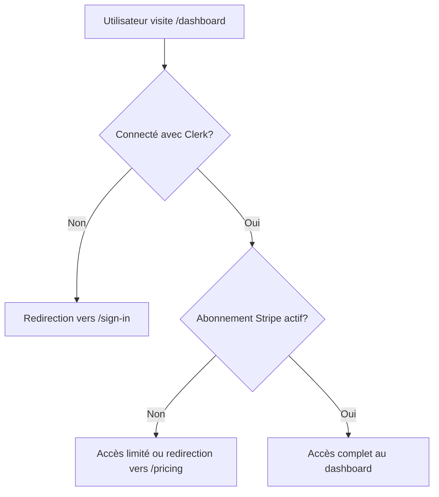

# 🛡️ Protection des routes : Clerk vs Stripe - Qui fait quoi ?

## 🎯 Deux niveaux de protection différents

### 1. **Clerk** = Protection par authentification
**"Est-ce que l'utilisateur est connecté ?"**

### 2. **Stripe** = Protection par abonnement  
**"Est-ce que l'utilisateur a payé ?"**

## 🔄 Comment ça fonctionne ensemble



## 🔐 Niveau 1 : Protection Clerk (Authentification)

### Fichier : `src/middleware.ts`
```javascript
import { clerkMiddleware, createRouteMatcher } from '@clerk/nextjs/server'

const isProtectedRoute = createRouteMatcher([
  '/dashboard(.*)',    // ← Clerk protège ces routes
  '/settings(.*)',
])

export default clerkMiddleware(async (auth, req) => {
  if (isProtectedRoute(req)) {
    await auth.protect()  // ← Clerk vérifie la connexion
  }
})
```

**Ce que fait Clerk :**
- ✅ Vérifie si l'utilisateur est connecté
- ✅ Redirige vers `/sign-in` si pas connecté
- ✅ Permet l'accès si connecté (même sans abonnement)

## 💳 Niveau 2 : Protection Stripe (Abonnement)

### Dans vos composants/pages
```javascript
// src/app/(protected)/dashboard/page.tsx
export default async function DashboardPage() {
  const user = await currentUser()  // ← Clerk : utilisateur connecté
  
  // Vérifier l'abonnement Stripe dans Supabase
  const { data: userData } = await supabase
    .from('users')
    .select('subscription_status, current_period_end')
    .eq('clerk_user_id', user.id)
    .single()

  const hasActiveSubscription = 
    userData?.subscription_status === 'active' &&
    new Date(userData.current_period_end) > new Date()

  if (!hasActiveSubscription) {
    // Afficher version limitée ou rediriger vers /pricing
    return <LimitedDashboard />
  }

  // Afficher version complète
  return <FullDashboard />
}
```

## 📊 Tableau comparatif

| Aspect | Clerk | Stripe |
|--------|-------|--------|
| **Rôle** | Authentification | Autorisation (paiement) |
| **Question** | "Qui es-tu ?" | "As-tu payé ?" |
| **Protection** | Routes entières | Fonctionnalités spécifiques |
| **Niveau** | Accès de base | Accès premium |
| **Redirection** | `/sign-in` | `/pricing` |

## 🏗️ Architecture complète

### Étape 1 : Middleware Clerk (Global)
```javascript
// middleware.ts - S'exécute sur TOUTES les requêtes
if (route === '/dashboard') {
  if (!userConnected) {
    redirect('/sign-in')  // ← Clerk bloque ici
  }
  // Sinon, continue vers la page
}
```

### Étape 2 : Vérification Stripe (Dans la page)
```javascript
// dashboard/page.tsx - S'exécute APRÈS que Clerk ait validé
export default async function Dashboard() {
  // On sait que l'utilisateur est connecté (grâce à Clerk)
  
  // Maintenant on vérifie s'il a payé (Stripe via Supabase)
  const subscription = await getSubscription(user.id)
  
  if (!subscription.active) {
    return <PaymentRequired />  // ← Stripe "bloque" ici
  }
  
  return <PremiumFeatures />
}
```

## 🎯 Exemples concrets

### Scénario 1 : Utilisateur non connecté
```
1. Visite /dashboard
2. Middleware Clerk : "Pas connecté" → Redirect /sign-in
3. Stripe n'est jamais vérifié
```

### Scénario 2 : Utilisateur connecté, pas d'abonnement
```
1. Visite /dashboard  
2. Middleware Clerk : "Connecté" → Continue
3. Page Dashboard : Vérifie Stripe → "Pas d'abonnement"
4. Affiche version limitée ou redirect /pricing
```

### Scénario 3 : Utilisateur connecté + abonnement actif
```
1. Visite /dashboard
2. Middleware Clerk : "Connecté" → Continue  
3. Page Dashboard : Vérifie Stripe → "Abonnement actif"
4. Affiche toutes les fonctionnalités
```

## 🔧 Implémentation pratique

### 1. Créer un hook pour vérifier l'abonnement
```javascript
// src/hooks/useSubscription.ts
export function useSubscription() {
  const { user } = useUser()  // Clerk
  const [subscription, setSubscription] = useState(null)

  useEffect(() => {
    if (user) {
      // Récupérer l'abonnement depuis Supabase
      fetchSubscription(user.id).then(setSubscription)
    }
  }, [user])

  return {
    hasActiveSubscription: subscription?.status === 'active',
    subscription
  }
}
```

### 2. Composant de protection par fonctionnalité
```javascript
// src/components/SubscriptionGate.tsx
export function SubscriptionGate({ children, fallback }) {
  const { hasActiveSubscription } = useSubscription()
  
  if (!hasActiveSubscription) {
    return fallback || <UpgradePrompt />
  }
  
  return children
}

// Utilisation
<SubscriptionGate fallback={<PaymentRequired />}>
  <PremiumFeature />
</SubscriptionGate>
```

## 🎨 Interface utilisateur

### Dashboard avec protection progressive
```javascript
export default function Dashboard() {
  const { hasActiveSubscription } = useSubscription()

  return (
    <div>
      {/* Fonctionnalités de base (toujours visibles) */}
      <BasicStats />
      
      {/* Fonctionnalités premium (conditionnelles) */}
      {hasActiveSubscription ? (
        <PremiumAnalytics />
      ) : (
        <div className="blur-sm">
          <PremiumAnalytics />
          <UpgradeOverlay />
        </div>
      )}
    </div>
  )
}
```

## 🎯 Résumé

**Clerk** = Garde du château 🏰  
*"Vous devez être inscrit pour entrer"*

**Stripe** = Contrôleur VIP 🎫  
*"Vous devez avoir un billet premium pour accéder à cette zone"*

### Ordre d'exécution :
1. **Clerk vérifie** : Utilisateur connecté ? 
2. **Si oui**, la page se charge
3. **Dans la page**, Stripe vérifie : Abonnement actif ?
4. **Affichage conditionnel** selon le statut d'abonnement

Cette architecture à deux niveaux vous donne une flexibilité maximale pour gérer différents types d'accès dans votre SaaS ! 🚀