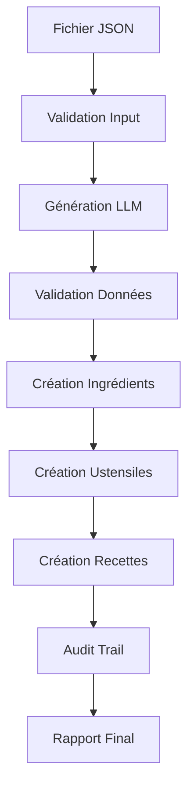

# 🍽️ Pipeline d'Ingestion Automatique TidiMondo

Pipeline intelligente pour générer et insérer automatiquement des recettes complètes avec ingrédients et ustensiles dans votre base de données TidiMondo.

## 🚀 Fonctionnalités

- **Génération IA** : Utilise OpenRouter pour créer des recettes réalistes et détaillées
- **Validation stricte** : Contrôle la cohérence des données (saisons, allergènes, régimes)
- **Cascade intelligente** : Crée automatiquement les ingrédients et ustensiles manquants
- **Audit complet** : Trace toutes les opérations pour un suivi précis
- **Sécurité renforcée** : Authentification hybride avec utilisateur système
- **Traitement par batch** : Génère plusieurs recettes d'un coup

## 📋 Prérequis

- Node.js 18+
- Accès à une base Supabase configurée avec le schéma TidiMondo
- Clé API OpenRouter
- Variables d'environnement configurées

## ⚙️ Installation et Configuration

### 1. Configuration des variables d'environnement

```bash
# Copier le template
cp scripts/data-ingestion/config/.env.template .env

# Éditer le fichier .env avec vos clés
nano .env
```

Variables requises :
- `SUPABASE_URL` : URL de votre projet Supabase
- `SUPABASE_SERVICE_ROLE_KEY` : Clé service role Supabase
- `OPENROUTER_API_KEY` : Clé API OpenRouter

### 2. Setup initial

```bash
# Exécuter la configuration initiale
node scripts/data-ingestion/setup.js

# Ou créer seulement le fichier .env
node scripts/data-ingestion/setup.js --create-env
```

Cette commande :
- ✅ Vérifie les variables d'environnement
- ✅ Teste la connexion Supabase
- ✅ Exécute les migrations SQL
- ✅ Crée l'utilisateur système
- ✅ Configure l'audit trail
- ✅ Valide l'API OpenRouter

## 🎯 Utilisation

### Commandes principales

```bash
# Générer des recettes depuis un fichier JSON
node scripts/data-ingestion/pipeline.js recettes-ete.json

# Simulation sans insertion (dry-run)
node scripts/data-ingestion/pipeline.js recettes-ete.json --dry-run

# Sauvegarder un rapport
node scripts/data-ingestion/pipeline.js recettes-ete.json --output rapport.json

# Afficher les statistiques actuelles
node scripts/data-ingestion/pipeline.js --stats

# Aide
node scripts/data-ingestion/pipeline.js --help
```

### Format du fichier d'entrée

Utilisez le template : [`templates/input-template.json`](templates/input-template.json)

```json
{
  "metadata": {
    "batch_name": "recettes_ete_2025",
    "description": "Recettes estivales",
    "target_count": 5
  },
  "recettes": [
    {
      "description": "Salade de tomates cerises et mozzarella",
      "contraintes": {
        "saison": ["ete"],
        "regime_alimentaire": ["vegetarien"],
        "difficulte": 1,
        "temps_preparation_max": 20,
        "type_repas": ["dejeuner", "diner"],
        "portions": 4
      }
    }
  ]
}
```

### Exemples prêts à utiliser

```bash
# Recettes d'été
node scripts/data-ingestion/pipeline.js scripts/data-ingestion/templates/examples/recettes-ete.json

# Recettes d'hiver
node scripts/data-ingestion/pipeline.js scripts/data-ingestion/templates/examples/recettes-hiver.json
```

## 📊 Architecture

```
scripts/data-ingestion/
├── config/
│   ├── pipeline.config.js      # Configuration principale
│   └── .env.template          # Template variables d'environnement
├── core/
│   ├── auth-manager.js        # Authentification hybride
│   ├── audit-logger.js        # Logging des opérations
│   ├── llm-client.js         # Client OpenRouter
│   └── validator.js          # Validation des données
├── database/
│   ├── ingredient-service.js  # Gestion ingrédients
│   ├── ustensile-service.js  # Gestion ustensiles
│   └── recipe-service.js     # Gestion recettes
├── templates/
│   ├── input-template.json   # Template d'entrée
│   └── examples/            # Exemples de fichiers
├── migrations/
│   └── setup-ingestion-system.sql
├── pipeline.js              # Script principal
├── setup.js                # Configuration initiale
└── README.md               # Documentation
```

## 🔄 Flux de traitement



1. **Lecture et validation** du fichier d'entrée
2. **Génération IA** du contenu avec OpenRouter
3. **Validation stricte** des données générées
4. **Cascade de création** : ingrédients → ustensiles → recettes
5. **Logging complet** de toutes les opérations
6. **Rapport détaillé** des résultats

## 📝 Contraintes et Validation

### Contraintes supportées

- **Saisons** : `printemps`, `ete`, `automne`, `hiver`
- **Régimes** : `vegetarien`, `vegan`, `sans_gluten`, `sans_lactose`, `halal`, `casher`
- **Types de repas** : `petit_dejeuner`, `dejeuner`, `diner`, `collation`, `apero`
- **Difficulté** : 1 à 5
- **Portions** : 1 à 20
- **Temps** : 1 à 480 minutes

### Validations automatiques

- ✅ Cohérence saisons recette ↔ ingrédients
- ✅ Respect allergènes par régime alimentaire
- ✅ Formats et unités valides
- ✅ Quantités réalistes
- ✅ Instructions détaillées

## 🔐 Sécurité

### Authentification hybride

- **Service Role Key** : Pour les opérations admin
- **Utilisateur système** : Attribution du contenu généré
- **Audit trail** : Traçabilité complète des opérations

### Bonnes pratiques

- 🔒 Clés API dans variables d'environnement
- 🔒 Validation stricte des données d'entrée
- 🔒 Rollback automatique en cas d'erreur
- 🔒 Logging de toutes les opérations

## 📈 Monitoring et Statistiques

### Commandes de monitoring

```bash
# Statistiques globales
node scripts/data-ingestion/pipeline.js --stats

# Historique d'un batch
# (via requête SQL directe)
SELECT * FROM ingestion_audit_log WHERE batch_name = 'mon_batch';
```

### Métriques suivies

- Nombre d'éléments créés/ignorés/en erreur
- Temps de traitement par opération
- Taux de succès des générations
- Distribution par catégories

## 🛠️ Maintenance

### Nettoyage des logs

Les logs d'audit peuvent être nettoyés automatiquement :

```javascript
// Dans votre code
const auditLogger = new AuditLogger(supabase, systemUserId);
await auditLogger.cleanupOldLogs(30); // Garder 30 jours
```

### Gestion des erreurs

- **Retry automatique** : 3 tentatives par défaut
- **Fallback model** : Modèle de secours OpenRouter
- **Validation stricte** : Arrêt en cas de données invalides
- **Rollback** : Annulation automatique en cas d'erreur

## 🚨 Dépannage

### Erreurs courantes

#### Connexion Supabase
```
❌ Connexion Supabase échouée
```
**Solution** : Vérifiez `SUPABASE_URL` et `SUPABASE_SERVICE_ROLE_KEY`

#### API OpenRouter
```
❌ Erreur OpenRouter (401)
```
**Solution** : Vérifiez `OPENROUTER_API_KEY`

#### Variables d'environnement
```
❌ Variables d'environnement manquantes
```
**Solution** : Copiez et configurez le fichier `.env`

#### Utilisateur système
```
❌ Utilisateur système non trouvé
```
**Solution** : Relancez `node scripts/data-ingestion/setup.js`

### Logs de débogage

Activez le mode debug dans votre `.env` :
```
DEBUG=true
```

## 📚 Exemples d'utilisation

### Génération simple

```bash
# Créer un fichier simple
echo '{
  "metadata": {"batch_name": "test_simple"},
  "recettes": [{
    "description": "Salade verte simple",
    "contraintes": {"difficulte": 1}
  }]
}' > test-simple.json

# Exécuter
node scripts/data-ingestion/pipeline.js test-simple.json
```

### Génération par saison

```bash
# Recettes d'été
node scripts/data-ingestion/pipeline.js scripts/data-ingestion/templates/examples/recettes-ete.json

# Recettes d'hiver  
node scripts/data-ingestion/pipeline.js scripts/data-ingestion/templates/examples/recettes-hiver.json
```

### Génération avec rapport

```bash
# Avec sauvegarde du rapport
node scripts/data-ingestion/pipeline.js recettes.json --output rapport-$(date +%Y%m%d).json
```

## 🤝 Contribution

1. Respectez l'architecture modulaire
2. Ajoutez des tests pour les nouvelles fonctionnalités
3. Documentez les changements dans ce README
4. Suivez les conventions de nommage existantes

## 📄 Licence

Ce projet fait partie de TidiMondo. Tous droits réservés.

---

💡 **Besoin d'aide ?** Consultez les exemples dans `/templates/examples/` ou lancez `node pipeline.js --help`